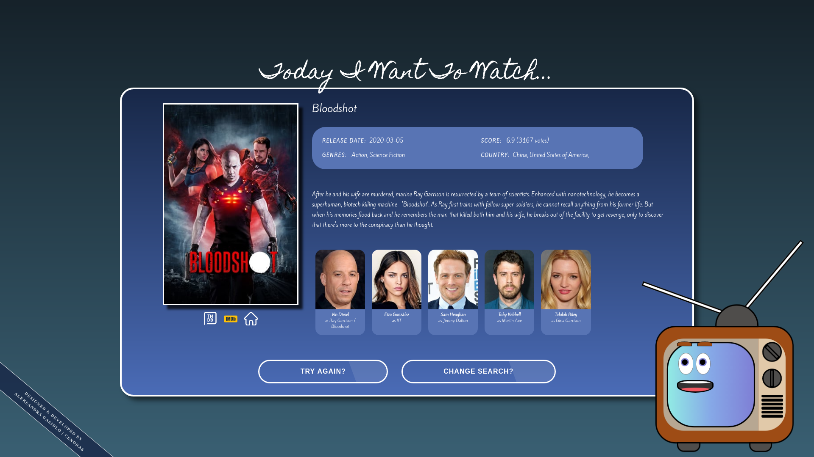

# Today I Want To Watch



## Description
"Today I Want To Watch" is a website which was created for those who have a hard time finding the perfect movie or tv series to watch. By choosing the movie's or tv show's genre or keyword, the website chooses a random movie/tv show and shows its details (like poster, cast, description, genres, release year or seasons, links to imdb and The Movie Database) which help you make the decision what to watch. You can eaither try to find another movie or change the searching options and try again!

This website uses [The Movie Database API](https://developers.themoviedb.org/) to display the movie/tv show data. It's possible to view this website on mobile phones, tablets, laptops or desktops (RWD).


## Live Demo
[Today I Want To Watch (live preview)](https://cenora6.github.io/today-i-want-to-watch/).

 
## Technologies and additional dependencies:

| Tool | Description |
| --- | --- |
| [React](https://www.npmjs.com/package/react/) | A JavaScript library for creating user interfaces. |
| [React Router Dom](https://www.npmjs.com/package/react-router-dom/) | DOM bindings for React Router. |
| [SASS](https://www.npmjs.com/package/sass/) | A preprocessor scripting language that is interpreted or compiled into CSS.  |
| [Typescript](https://www.npmjs.com/package/typescript/) | An open-source language which builds on JavaScript, |
| [Node Sass](https://www.npmjs.com/package/node-sass/) | A library that provides binding for Node.js to LibSass, the C version of the popular stylesheet preprocessor, Sass. |
| [Axios](https://www.npmjs.com/package/axios/) | Promise based HTTP client for the browser and node.js |

## Installation:

-  ```git clone https://github.com/Cenora6/today-i-want-to-watch.git``` to clone the repository
- ```npm install``` to install all dependencies
- ```npm start``` and ```http://localhost:3000/``` in the browser to preview the website
